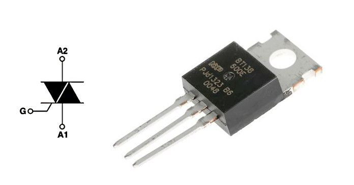
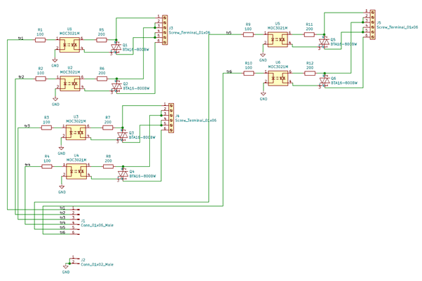
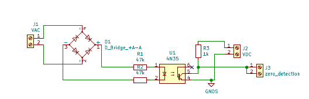
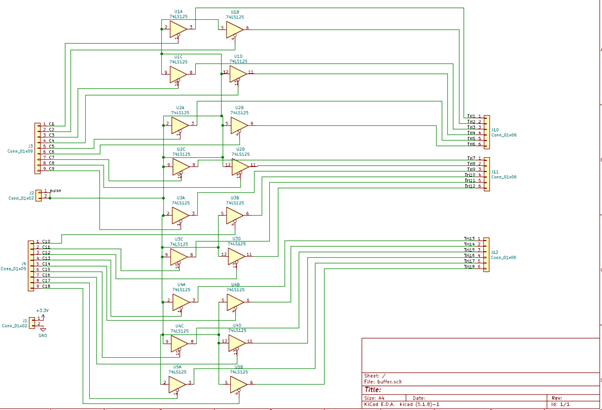
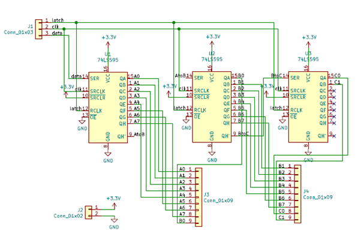
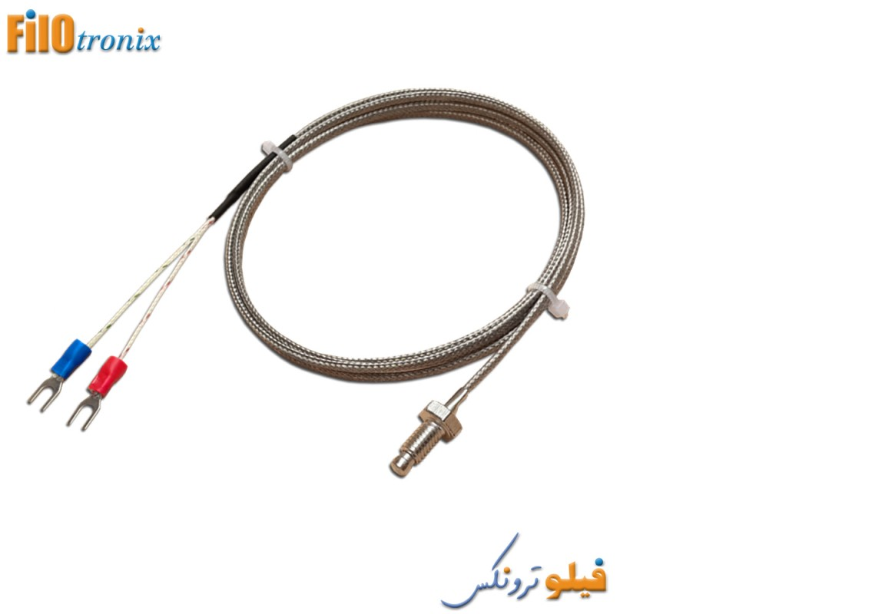
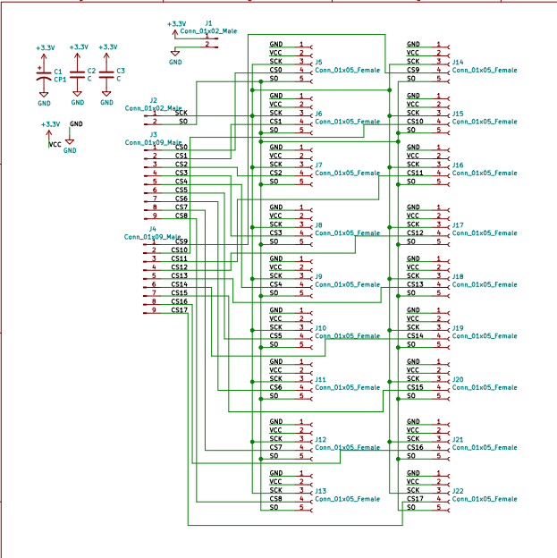
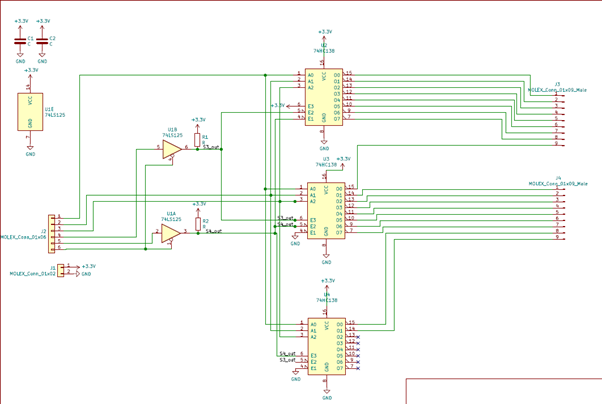

--------------------------------------------
# Plastic Injection Molding Control System

## Abstract

This work was developed by the startup 'The Fourth Space', where senior Kim Seong-jun from the 17th generation of Barami is affiliated, as an outsourcing project for Barami's plastic injection molding machine control system.

The system is mainly divided into a heating bed (heater) that melts the plastic, a temperature sensor, and a solenoid valve that applies pressure to the melted plastic. Both the heater and the valve operate on 220VAC alternating current.

To control the 220VAC AC heater, a triac, a bidirectional switching device, was used. To control multiple triacs, each control signal is input to a 3-state buffer using a shift resistor, and the control signal is generated at the appropriate timing through a zero-detection circuit to turn the buffer on/off. This method allows for controlling the power of the AC heater. Additionally, the temperature of the AC heater is measured using a K-type temperature sensor, and by comparing it with the target temperature, the AC heater can be controlled within a range of 10 degrees of error through ON/OFF control. The solenoid valve also operates on 220VAC, so it is controlled in the same way using a triac.

--------------------------------------------------

## 220VAC Heater Control

### Triac

A triac is a bidirectional switching device for high voltage and high current. When a pulse signal is given to the Gate, it shorts between A1 and A2 as long as the voltage value is above a certain level, and it disconnects again when the voltage drops below a threshold. The direction doesn't matter. In other words, by providing a pulse when the instantaneous voltage of the AC is 0, AC current can flow through the triac. This can be used to control the current flowing to the heater and valve.

## Triac control system

### Optocoupler Circuit

When pulses are provided to tr1~tr6 at the appropriate timing, AC current flows to the heaters connected to J3, J4, and J5. When the pulse supply is stopped, the current is cut off from the moment the AC instantaneous voltage becomes 0. The MOC3021(U1U6) device is an optocoupler, which separates the high current, high voltage AC circuit from the low voltage, low current DC circuit.

### Pulse Generator

The circuit that generates the pulse produces a pulse at J3 the moment the AC voltage becomes 0. The detailed principle is as follows:

220VAC is rectified through bridge diodes and, through a resistor, provides the Photocoupler 4N35 with a rectified signal that has the same phase as 220VAC but at a lower voltage. When voltage is applied to the primary side of the 4N35, the secondary side's bjt operates, making the zero detection signal become 0. When the primary side voltage is 0, the bjt does not operate, and the zero detection voltage becomes VDC. Therefore, a pulse is generated the moment the voltage of 220VAC becomes 0.

This pulse is input into the 3-state buffer circuit.

### Tri-state Buffers

The tri-state buffer (buffer hereafter) circuit is divided into pulseIn, signal input, and pulseOut. When 0 is input to the signal input, the buffer passes the pulse, and when 1 is input, the pulse is blocked in the buffer. PulseOut is connected to tr1~tr6 of the above optocoupler circuit (there are a total of 3 optocoupler circuit boards). The triac is controlled by determining the signal value given to the buffer from the Arduino.

### Shift Registers

Directly inputting signals from the Arduino is unstable due to reasons like the insufficient number of Arduino pins and unstable signal current. Therefore, a method was chosen to store pre-determined signals in the shift register and connect the shift register output to the buffer signal end.

--------------------------------------------

## Temperature Measuring

To determine the current supplied to the heater, the temperature of the heating blocks must be measured. The temperature measurement circuit is composed of multiple temperature sensors and a decoder circuit to control them

### Temperature Sensers

The advantage of the K-type temperature sensor is its wide usable temperature range. It's suitable for systems that need to operate at high temperatures, which is why it was used in this project.

### Temperature Senser Connection Bus

The temperature sensor communicates its measurements to the Arduino via SPI communication. SCK is the clock, SO is the data, and CS is the pin that determines the communication blockage.

### Decoders

Since the Arduino can access only one temperature sensor at a time, only the selected temperature sensor should be connected to the Arduino, and the rest should be temporarily disconnected. The CS pin of the temperature sensor serves this function, and the values to be input into the CS pins are output through the decoder. The Arduino selects the temperature sensor to connect by inputting binary numbers to the decoder.

---------------------------------------------------------

## Solenoid Valve
<video src="./assets/img/valve.mp4" width="720px"></video>

A solenoid valve is applied to press the melted plastic. The control method is the same as the heater, using a triac. Since the same type of circuit is used, a detailed circuit description is omitted.

--------------------------------------------------------

## Raspberry Pi

While controlling the system with Arduino is sufficient, the client requested remote control functionality through a web application, so the Arduino was connected to the web via a Raspberry Pi.

--------------------------------------------------------

## Assembled Borads

This is how the circuit board looks when connected to the machine.
